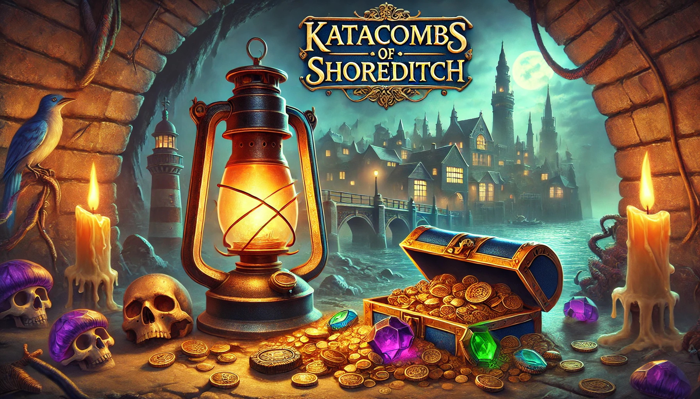
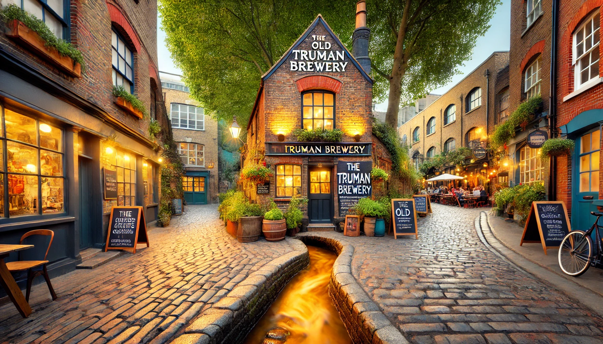

# Katacombs of Shoreditch by Marco Consolaro



This kata is a little more structured and challenging so you can try to put many concepts and principles into practice in a domain that can benefit from them. This is quite a large kata, so expect to spend some time with it.

Inspired by Colossal Cave Adventure, this is a kata for building a text adventure game that can be expanded 
incrementally and indefinitely, limited only by imagination.

The game is based on a console application that describes a fictional underground world to be explored by the player via a set of commands. The world is a collection of locations linked to each other geographically (on North, South, East or West) or via specific connection points (doors, passages, gates, stairs, etc.). The player can move among the locations using cardinal points for directions or exploiting the connection points with actions or items.

**Other important aspects:**

- It is possible to just look in every direction, but not all the directions are always available for being looked at,
nor to move to.
- The world will have treasures hidden in several locations, which can be revealed if players enter the location or 
  use the correct item in the correct location.
- The game terminates when the player finds the exit of the katacombs, and the score is the sum of the value of the 
  treasures collected.
- When looking somewhere without anything interesting, the system should reply, **“Nothing interesting to look at 
  there!”**
- When a general action is not available, the system will reply, **“I can’t do that here!”**
- When the system can’t understand the command, it should prompt, **“I don’t understand that. English please!”**

## PART I

### Starting the game

The game at startup shows the title and main description of the initial location. When the player moves to another location, the system always prompts title and main description for the new location.




```
1 LOST IN SHOREDITCH.
2 YOU ARE STANDING AT THE END OF A BRICK LANE BEFORE A SMALL BRICK BUILDING CALLED THE\
3  OLD TRUMAN BREWERY.
4 AROUND YOU IS A FOREST OF RESTAURANTS AND BARS. A SMALL STREAM OF CRAFTED BEER FLOWS\
5  OUT OF THE BUILDING AND DOWN A GULLY.
6 >
```

### Exploring the world

#### Moving

`GO` followed by the letter of the cardinal point.

```
1 > GO N => move to the NORTH
2 > GO E => move to the EAST
3 > GO S => move to the SOUTH
4 > GO W => move to the WEST
```

### World correctness

There are only two requirements for the world. The first is that there should not be two different locations with the same title. The second is that the locations must have mutually reversed references to each other. This means that if from location A going South the player ends up in location B, then from location B going North I must end up in location A. The same principle should be valid for all cardinal points, but also when going up and down.

